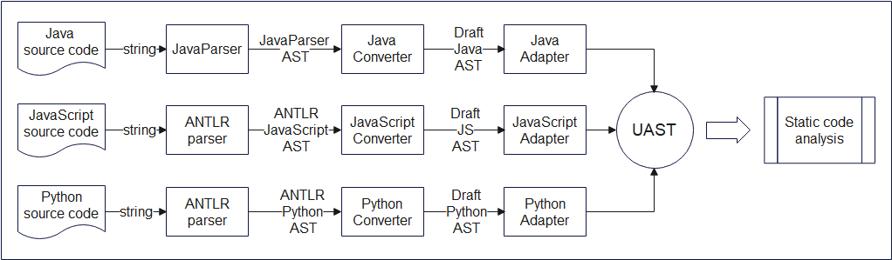
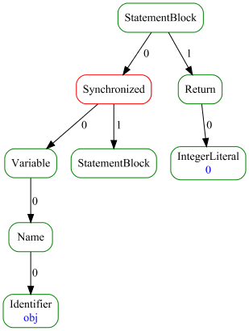
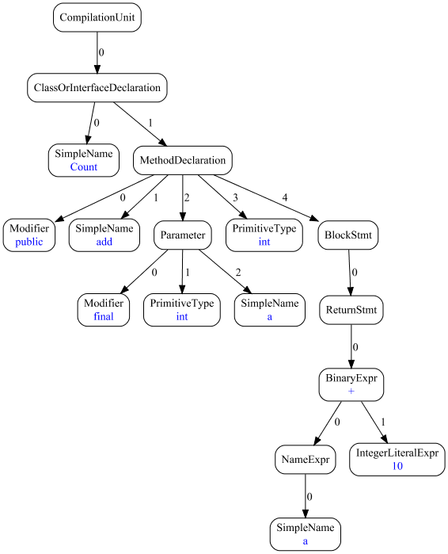
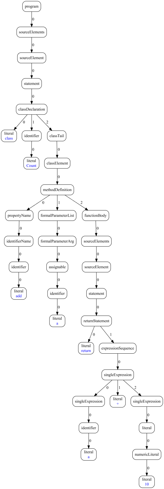
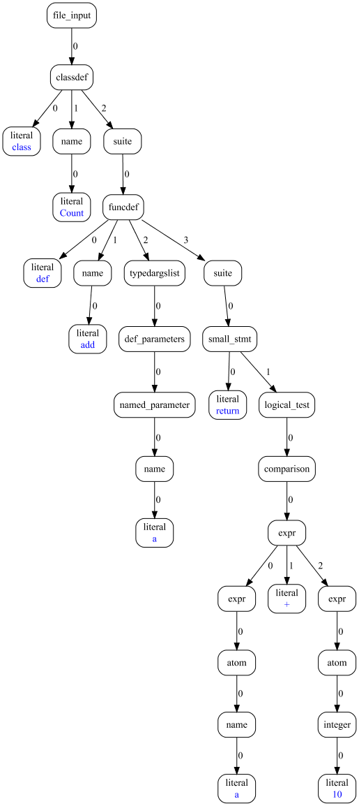
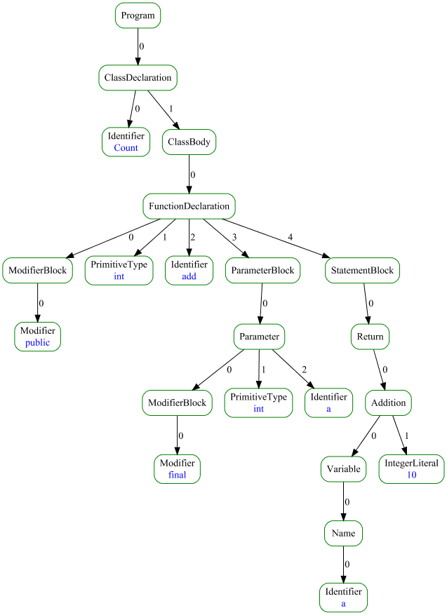
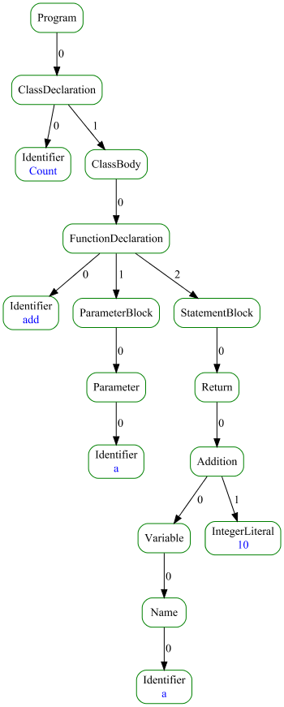
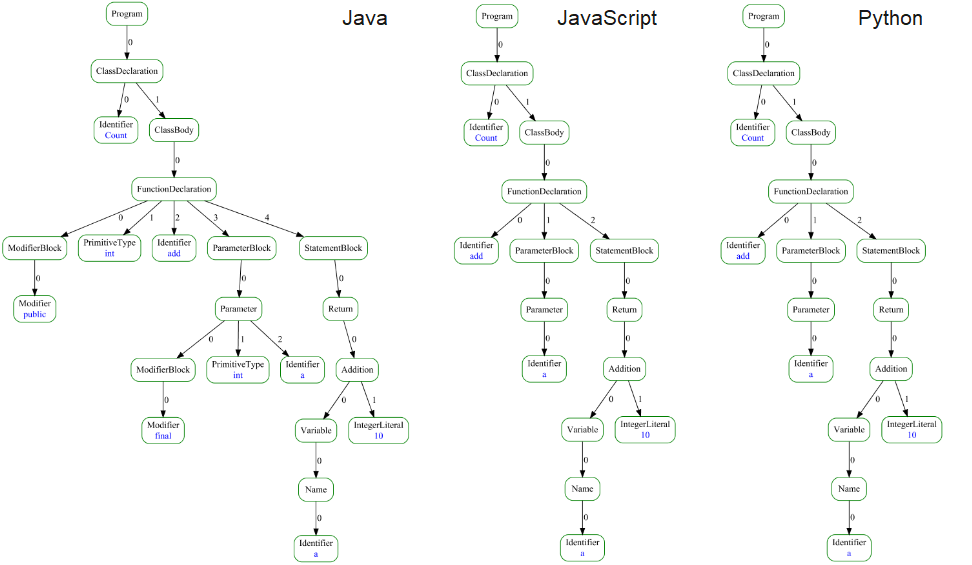

# Unified Abstract Syntax Tree


[](https://codecov.io/gh/unified-ast/unified-ast)
[](https://github.com/unified-ast/unified-ast/blob/master/LICENSE.txt)
___

## Brief

*Unified Abstract Syntax Tree (UAST)* is a generalized model of a syntax tree
constructed from abstract syntax trees of several programming languages.

This project collects classes describing the UAST and also adapters that convert initial formats of ASTs of different 
languages into the unified structure.

We assume that our UASTs can be used to simplify static code analysis algorithms.

For now the project contains a partial unification of:
- Java - from [JavaParser](https://javaparser.org/) AST
- JavaScript - from [ANTLR](https://github.com/antlr/grammars-v4/tree/master/javascript/javascript) AST
- Python - from [ANTLR](https://github.com/antlr/grammars-v4/tree/master/python/python) AST

To create source code for UAST nodes and transformation rules we use [Astranaut](https://github.com/cqfn/astranaut).

## Motivation

There are static code analyzers that use AST models to process source code.
In the case of increasing demand for a software product, developers face the need to expand the functionality 
of the program and transfer the logic of algorithms to new relevant programming languages.

In general, for each programming language to be processed, a different parser is used.
Each parser provides a unique structure of an AST.
Even for similar languages and similar constructions of these languages, existing third-party parsers 
yield ASTs of different structures.
Therefore, adaptation of existing algorithms for new syntax trees is a time-consuming task.

For detailed description of the problem, see [ongoing research](#ongoing-research).

We suppose that creation of a UAST for a group of required programming languages would allow developers 
to use the same algorithms to analyze the code of chosen languages.

## Requirements

* Java 1.8
* Maven 3.6.3+ (to build)

## How to use

### Command line interface

> Here and below, it is assumed that the name of the executable file is `uast.jar`.

In the CLI mode, the project performs transformation of initial ASTs into UAST:
it loads a file with source code in a general-purpose programming language, parses it with a third-party parser 
and adapts the result into the unified format.

Syntax:

```
java -jar uast.jar --parse <path to source file> [optional arguments] 
```

Required arguments:

* `--parse` (short: `-p`), the path to a file that contains source code in some supported programming languages.
  Expected file extensions are `.txt`, `.java`, `.js`, `.py`.

* `--lang` (short: `-l`), the name of the source file language. For Java, it should be `java`, 
  for JavaScript - `js` or `javascript`, for Python - `python`. 
  This option is required if the file with the source code has a `.txt` format, otherwise you can omit it.
  
Optional arguments:

* `--output` (short: `-o`), the path to the `JSON` file where the result syntax tree will be saved
  in a serialized format, file extension is `.json`. The `JSON` format is described [here](https://github.com/cqfn/astranaut#syntax-tree-representation).

* `--visualize ` (short: `-v`), the path to the image file where the result syntax tree will be saved
    in a graphical format. Supported image extensions are `.png` and`.svg`.

* `--raw` (short: `-r`), without a parameter, indicates the necessity to disable the conversion of an AST into a UAST. 
  Supported image extensions are `.png` and`.svg`. You can use it, for example, in combination with visualizing
  to conduct research on a unification of syntax trees.

Example:

```
java -jar uast.jar --parse D:\sources\MyClass.java -o D:\storage\MyClass.json -v D:\storage\MyClass.png -r
```

## Project structure



The input of the program is a file with source code in some programming language.
The program sends text of the source to a relevant 3rd-party parser.
The result of the parser is a specific AST with a structure provided by a parser (raw format).

In order to be able to modify source trees we need to customize them into our [AST model](#ast-model).
To do so, we use *converters* that convert ASTs from formats provided by 3rd-party parsers 
to the `Node` interface.
A converter returns a *draft* version of an AST.
This tree consist of `DraftNode` nodes that are expected to be modified.

Further, a draft AST is passed to an *adapter*.
There is an adapter for each language to be analyzed.
The adapter takes an array of transformation rules and a draft AST as input. 
Then it tries to match each rule to each node of the tree, starting with leaf nodes. 
If a rule is matched to a node, the node (and all its successors) is replaced by a new node (new subtree).

Before an adapter processes a node, it converts this node into a `ConvertibleNode` object.
The feature of the `ConvertibleNode` is the existence of methods to change the list of child nodes.
We use this class in order to temporarily make nodes mutable.

The result of the adaptation can be complete or incomplete:
* With full conversion to a UAST all nodes of the tree are of *red* or *green* color. 
They are immutable.
In this case each tree node will have the full set of attributes (type, color, language), and such a tree is the most suitable for further syntax analysis. 

* In the case of incomplete conversion, a partially converted tree is returned, in which some subtrees are *green-red*, but the root node is still unprocessed. 
Technically, unprocessed nodes remain of the `ConvertibleNode` type. 
However, the project returns only a tree of the basic `Node` objects.

You can evaluate the success of the unification by analyzing the properties of the root node.
For a fully adapted UAST the method `getProperty` with the parameter `language` will return the string `common`.

We expect to use the result UAST model in static code analyzers.

## Green-Red syntax tree

We suggest the *Green-Red Syntax Tree* (GRST) model as an approach to unify the syntactic constructions of languages. 
The GRST is an approach to an AST markup.

In this approach the AST nodes are "colored" in "green" or "red":
* *Green* node – a GRST node that belongs to some syntax represented in all programming languages under consideration.
* *Red* node – a node in GRST which does not belong to the general syntax represented in all programming languages under consideraion. 
  It is language-specific.

A distinctive feature of a *green* node is the ability to generate the corresponding code written in any of the programming languages considered from it. 
And it is impossible to extract the source code in each of the languages from a *red* node.

We assume that a *green* tree consists only of *green* nodes. 
Such a tree has the following properties:
1) code in any programming language under study can be generated from it; 
2) an analyzer can be written on the basis of such a UAST and be suitable for any programming language under consideration.

Examples of constructs that can be represented by *green* nodes:
* a conditional statement; 
* a function declaration; 
* a binary operation;
* a `for` loop.

Examples of constructs that can be represented by *red* nodes:
* slices (Python); 
* a cycle `for in` (JavaScript); 
* a `synchronized` method (Java).

For the construction of GRST it is necessary to initially specify the group of programming languages for which 
the AST unification has to be carried out. 
In other words,unified trees can be constructed with relation to any language, based on its comparison with other languages. 
The markup of GRST allows to visually evaluate by the number of green nodes the possibility to create unified constructs
from several programming languages. 
The presence of *red* nodes shows the semantic differences in the languages.

Example:

Suppose we created a UAST for Java, Python and JavaScript languages.

Let's consider the following Java code snippet:

```java
public class Example {
    public int getValue(Object obj) {
        synchronized (obj) {
        }
        return 0;
    }
}
```

A part of the UAST constructed from this snippet may look like this:



The `StatementBlock`, `Return` statement, `Variable` and other *green* nodes have corresponding constructs in all 3 languages.
However, the node `Synchronized` is a unique Java construct.
It does not have analogues in JavaScript and Python.
Therefore, this node is *red*.

## AST model

In the project, an abstract syntax tree is a directed graph (by the definition used in discrete mathematics) with 
the following additional properties:
* Each node has a type (represented as a string); 
* Each node may optionally have data (also represented as a string);
* The order of the successors is significant.

A *type* is a required property of a node, that allows you to assign the node to a certain class. 
For example, `VariableDeclaration` is a common name for all nodes that represent declarations of variables in source code.

A *data* is an optional property of a node that represents a string value.
Most commonly, data is a property of terminal (leaf) nodes.
For instance, string and numeric literals contain data.

Non-terminal nodes have children, that are stored in a list.
The list is arranged in ascending order of children indexes.
The order of the children is determined by a grammar of the programming language from which an AST is built.
For example, if a grammar rule is `<assignment> ::= <left expression> <operator> <assignment expression>`, then 
the node `assignment` has 3 children. The child `left expression` has the index of `0`, 
the child `operator` has the index of `1`, and the `assignment expression` has the index of `2`.

> In our project, we construct an AST only of nodes and their relation. We do not use edge entities.

### §1. Node

The base interface in the project is `Node` which represent each node in an AST.
Every specific node in AST or UAST extends or implements `Node`.

A `Node` has the following methods:

* `getType()` - returns a `Type` of the node as an object;
* `getTypeName()` - returns a type of the node as a string;
* `getData()` - returns node`s data if it exists;
* `getChildCount()` - returns an amount of node`s children;
* `getChild(int index)` - returns a specific child node by its index;
* `getChildrenList()` - returns a list of node`s children;
* `belongsToGroup(String type)` - checks if the node type belongs to the specific [hierarchy](#2-type-hierarchy) of nodes.

### §2. Type hierarchy

A *type hierarchy* is a list of node types, starting from the current node with some type and going upwards by abstraction level.

Example:

In Java `Binary Expression` is a variation of `Expression` construct.
Also, `Binary Expression` is a common name for relational and arithmetic expressions.
Moreover, arithmetic expressions include a variety of operands, like addition, multiplication and others.
Then the hierarchy for the node that performs addition will be the sequence:
```
Expression <- Binary Expression <- Arithmetic Expression <- Addition
```

### §3. Abstract node

An *abstract node* is a node that extend the `Node` class or its descendant. 

We use an abstract node to describe a generalized name of several language constructs. 

Example:

The `Arithmetic Expression` construct can be implemented in source code by `Addition`, `Subtraction`, 
`Multiplication` and other binary expressions.
In our AST `Arithmetic Expression` will be an abstract node.

If the full hierarchy of language constructs is 
```
Expression <- Binary Expression <- Arithmetic Expression <- Addition
```

then `Expression` and `BinaryExpression` will also be abstract.

### §4. Final node

A *final (non-terminal) node* is a node that implements the `Node` class or its descendant.

We use a final node to describe the last node in the hierarchy of language constructs. 

Such nodes either contain a list of child nodes, or are independent units in the language, or represent a literal.

Example:

If the full hierarchy of language constructs is
```
Expression <- Binary Expression <- Arithmetic Expression <- Addition
```
then in our AST the `Addition` will be a final node.

### §5. Type

To describe the properties of nodes we also use the interface `Type`.
The `TypeImpl` class within each `Node` class implements this interface.
Each final node has a `Type`.
This project uses `Type` objects to store and collect additional data about nodes and their inheritance hierarchy.

A `Type` has the following methods:

* `getName()` - returns a type of the node as a string;
* `getChildTypes()` - returns a list of child node descriptions (ChildDescriptor) with additional information;
* `getHierarchy()` - returns the hierarchy of type names to which the current type belongs;
* `belongsToGroup(String type)` - checks if the node type belongs to a specific hierarchy;
* `createBuilder()` - returns a constructor class that creates nodes if the given type;
* `getProperty(String name)` - returns additional properties describing the features of the node type.

A `Type` has properties which we use as part of the unification task.
Properties is a dictionary, in which a key is the name of the type characteristic, 
and a value is one of the possible options of this characteristic.

For now, we use the following properties:
* `color` - a color of the node type which can be:
  - *green*, if all the languages under consideration have constructs of this type;
  - *red*, if a current type is language-specific, i.e. only a specific language has a construct of this type.
* `language` - a name of a programming language under processing, may be:
  - `java`, if a *red* node belongs to Java;
  - `python`, if a *red* node belongs to Python;
  - `js`, if a *red* node belongs to JavaScript;
  - `common`, if a node is *green*.

### §6. Node tags

The [DSL](https://github.com/cqfn/astranaut#domain-specific-language) that we use for nodes generation has syntax
that allows to add tags to node's children.

Knowing a tag you can get some node's child directly by the name of its tag.
The name of such a getter is `get` + capitalized `<tag>`.

In some cases using a tag is more convenient than referring to a child by its index.

Example:

Suppose you need to analyze a `FunctionDeclaration` node which is obtained as a result of source code parsing and 
may have a variable number of children.

If such a node is created by the following rule:

```
FunctionDeclaration <- [ModifierBlock], [TypeName], Identifier, ParameterBlock, StatementBlock;
```
then to get the name of the function, which is of `Identifier` type you will need to, firstly, get the amount of children.
Secondly, you will iterate over them and check their types in order to find the expected one.

However, if a node is created with the usage of tags:

```
FunctionDeclaration <- [modifiers@ModifierBlock], [restype@TypeName], name@Identifier, parameters@ParameterBlock, body@StatementBlock;
```
you can get a function name with the only one method `getName()`.

## Ongoing research

The unification of ASTs is a research task. Currently, we conduct experiments on creation of the UAST from Java,
JavaScript and Python ASTs.
This projects helps us to test and collect results of our approach.

### Example

To describe the prerequisites for the creation of UAST more clearly, let us provide an example.

Below there are 3 code snippets in Java, JavaScript and Python languages. All of them are semantically similar.

Java:

```java
class Count {
  public int add(final int a) {
    return a + 10;
  }
}
```

JavaScript:

```javascript
class Count {
    add(a) {
        return a + 10;
    }
}
```

Python:

```python
class Count:
    def add(a):
        return a + 10
```

We used the JavaParser parser to compile the Java code, and ANTLR grammars with some additional simplification
for JavaScript and Python languages.
The following images show ASTs constructed from the provided code snippets.

Java:



JavaScript:



Python:




It can be noticed that same language constructs (like `class declaration` or `addition` binary expression), 
which have identical syntax in all three languages, have different representation in the corresponding ASTs.


It is also worth noting that it is not only ASTs built with different parsers that distinguish. 
Parsers from the same ANTLR developer for Python and JavaScript grammar create ASTs which subtrees are also different.

### Approach

With the usage of [Astranaut](https://github.com/cqfn/astranaut), we generated a set of classes and rules that
unify the constructions in code snippets provided above.

Result trees look like this:

Java:



JavaScript:



Python:


Let's analyze the difference between these trees using side-by-side comparison.



In the UASTs JavaScript and Python snippets have equal representation.
The UAST of Java has additional nodes responsible for modifiers and types of objects.

However, base nodes, which are significant within the semantics, are the same for all 3 languages.
Thus, by writing an algorithm on such a tree, you can process several languages at once.

You may wonder, why `ModifierBlock` is a *green* node considering the fact that it is only a feature of Java.
In order to increase the number of *green* nodes in UAST we tend to create common nodes that have *optional* children.
Such children are not *red*, but may appear in ASTs of special languages.
For example, `FunctionDeclaration` will contain `ModifierBlock` and a node for the return type only if you parse languages
that have such constructs in their syntax, like Java.
For Python and JavaScript they will be omitted.

### Contributors

* Ivan Kniazkov, @kniazkov
* Polina Volkhontseva, @pollyvolk

See our [Contributing policy](CONTRIBUTING.md).